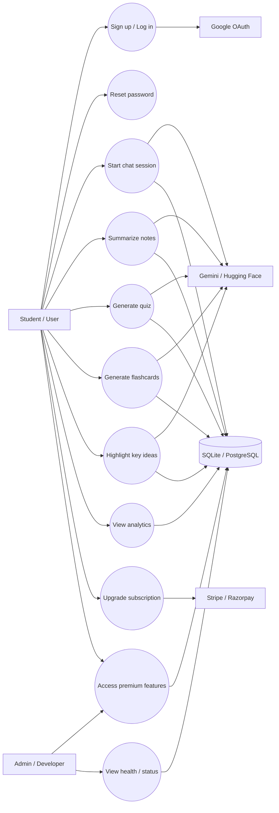
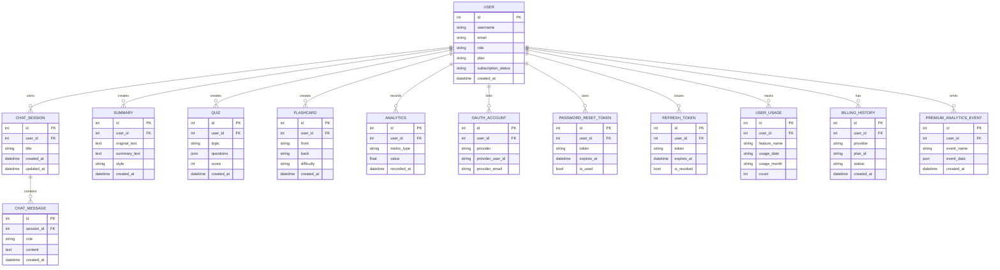

# AI Study Assistant - System Architecture

## Overview

AI Study Assistant is a two-tier web application built around a React single-page app and a FastAPI backend. The frontend handles the interactive study workspace, while the backend owns authentication, billing, AI orchestration, persistence, and operational concerns.

## Use Case Diagram



This is a Mermaid approximation of the system's UML use cases. It keeps the diagram renderable inside markdown while still showing the major user, admin, AI, billing, and persistence interactions.

## ER Diagram



The ER diagram reflects the main persisted entities in [backend/database.py](backend/database.py) and shows how user-scoped study, auth, and billing records hang off the `User` aggregate.

```text
┌────────────────────────────────────────────────────────────────────┐
│ Frontend: React SPA                                                │
│ - App shell, auth UI, study tools, dashboard, premium flows        │
│ - Tailwind CSS, Framer Motion, component-level feature modules     │
│ - Runs on http://localhost:3000                                    │
└────────────────────────────────────────────────────────────────────┘
                              │
                              │ JSON over HTTP + JWT/session tokens
                              ▼
┌────────────────────────────────────────────────────────────────────┐
│ Backend: FastAPI API                                               │
│ - Auth, billing, chat, summaries, quizzes, flashcards, analytics   │
│ - Agent state, planner, AI fallback, middleware, validation        │
│ - Runs on http://localhost:8000                                    │
└────────────────────────────────────────────────────────────────────┘
                              │
         ┌────────────────────┼────────────────────┬────────────────┐
         │                    │                    │                │
         ▼                    ▼                    ▼                ▼
    SQLite/Postgres      Gemini / HF API      Google OAuth      Stripe / Razorpay
    SQLAlchemy models     AI inference only    Sign-in           Payments
```

## Frontend Architecture

The frontend entry point is [frontend/src/index.js](frontend/src/index.js), which mounts the React app inside `ThemeProvider` and `AuthProvider`. The main composition root is [frontend/src/App.jsx](frontend/src/App.jsx), which wires together the study workspace, onboarding, pricing, premium gates, productivity tools, and modal flows.

### Frontend Layers

| Layer | Responsibility |
| --- | --- |
| App shell | Global layout, navigation, modal orchestration, theme switching |
| Auth state | User session, login/logout, premium status, profile refresh |
| Study tools | Chat, summary, quiz generation, flashcards, notes highlighting |
| Productivity tools | Pomodoro, goals, streaks, review sessions, search, quick actions |
| Premium UX | Pricing page, upgrade modal, feature gating, checkout flows |

### Frontend Building Blocks

The current UI is component-driven and feature-rich. Major modules live under [frontend/src/components](frontend/src/components), including:

- [AuthContext.jsx](frontend/src/components/AuthContext.jsx) for session management and API-authenticated user state.
- [AuthModal.jsx](frontend/src/components/AuthModal.jsx) and related auth screens for login, registration, Google sign-in, and reset-password flows.
- [ClaudeChat.jsx](frontend/src/components/ClaudeChat.jsx), [NotesHighlighter.jsx](frontend/src/components/NotesHighlighter.jsx), [Summary.jsx](frontend/src/components/Summary.jsx), [QuizGenerator.jsx](frontend/src/components/QuizGenerator.jsx), and [FlashcardsContainer.jsx](frontend/src/components/FlashcardsContainer.jsx) for study actions.
- [Dashboard.jsx](frontend/src/components/Dashboard.jsx) and [Analytics.jsx](frontend/src/components/Analytics.jsx) for progress views.
- [premium/PricingPage.jsx](frontend/src/components/premium) and [premium/UpgradeModal.jsx](frontend/src/components/premium/UpgradeModal.jsx) for monetization.

### Frontend Data Flow

User action -> React component state -> API client in `components/services` and auth context -> FastAPI endpoint -> persisted data / AI response -> UI state update.

## Backend Architecture

The backend entry point is [backend/main.py](backend/main.py). It creates the FastAPI application, registers middleware, includes auth and billing routers, initializes the database, and exposes the core study-tool endpoints.

### Request Handling Pipeline

1. Request enters FastAPI.
2. CORS, security headers, rate limiting, request logging, and request stats middleware run.
3. Authentication and role dependencies validate the caller when needed.
4. Route handlers validate request bodies using Pydantic schemas from [backend/schemas.py](backend/schemas.py).
5. Business logic calls agent, AI, billing, or persistence modules.
6. The API returns JSON responses, streaming responses, or standardized error payloads.

### API Surface

The backend is organized by domain rather than by a single monolithic controller:

| Domain | Main Files | Purpose |
| --- | --- | --- |
| Authentication | [backend/auth.py](backend/auth.py), [backend/auth_routes.py](backend/auth_routes.py) | Local login, Google OAuth, token lifecycle, password reset |
| Billing | [backend/billing.py](backend/billing.py), [backend/billing_routes.py](backend/billing_routes.py) | Plan access, checkout, webhook handling, subscription state |
| Core study tools | [backend/main.py](backend/main.py) | Chat, summarize, highlight, quiz, flashcards, analytics |
| Agent orchestration | [backend/agent_state.py](backend/agent_state.py), [backend/agent_planner.py](backend/agent_planner.py) | Session memory and intent routing |
| AI integration | [backend/gemini_wrapper.py](backend/gemini_wrapper.py), [backend/ai_fallback_wrapper.py](backend/ai_fallback_wrapper.py), [backend/huggingface_client.py](backend/huggingface_client.py) | Model inference and fallback behavior |
| Persistence | [backend/database.py](backend/database.py), [backend/config.py](backend/config.py) | ORM models, DB session factory, environment-backed config |
| Cross-cutting concerns | [backend/middleware.py](backend/middleware.py) | Rate limiting, security headers, logging, request stats, caching |

### Agent Model

The backend is designed as an AI agent pipeline, not just a thin API proxy. [backend/agent_state.py](backend/agent_state.py) stores session-scoped context, while [backend/agent_planner.py](backend/agent_planner.py) determines the action path for a user request.

Typical flow:

1. User submits a message or study task.
2. Intent is classified by the planner.
3. Session state is loaded from the agent manager.
4. The chosen tool constructs a prompt and calls the AI layer.
5. The result is normalized, persisted, and returned.
6. Session memory is updated for future turns.

### AI Integration

AI calls are handled through provider wrappers instead of directly from route handlers.

- [backend/gemini_wrapper.py](backend/gemini_wrapper.py) handles primary model inference, retries, and timeout control.
- [backend/ai_fallback_wrapper.py](backend/ai_fallback_wrapper.py) provides graceful degradation when the primary provider fails.
- [backend/huggingface_client.py](backend/huggingface_client.py) supports alternate model routing where configured.

The application treats Google Gemini as inference only. No model training or fine-tuning occurs inside this project.

## Data Architecture

The data layer uses SQLAlchemy models defined in [backend/database.py](backend/database.py).

### Primary Entities

- `User` stores identity, auth provider, role, plan, and subscription metadata.
- `ChatSession` and `ChatMessage` store conversation history.
- `Summary`, `Quiz`, and `Flashcard` store generated study artifacts.
- `Analytics` and usage tables track activity and progress.
- `OAuthAccount`, `RefreshToken`, and password reset tables support account lifecycle.
- Billing tables store subscription and payment history.

### Storage Strategy

| Environment | Database | Notes |
| --- | --- | --- |
| Development | SQLite | Default local database for quick startup |
| Production | PostgreSQL | Configured through `DATABASE_URL` |

## Security and Cross-Cutting Concerns

[backend/middleware.py](backend/middleware.py) provides production-oriented request controls:

- Rate limiting through SlowAPI.
- Security headers and CORS configuration.
- Request logging with request IDs and response timing.
- Request statistics and in-memory response caching.

Authentication is JWT-based and role-aware. The backend enforces access using dependencies such as `get_current_user`, `require_role`, and `require_premium`.

## Deployment Model

The repo is structured for local Windows development with startup scripts at the repository root. The canonical runtime is the root `.venv`, with the backend launched on port 8000 and the frontend on port 3000.

Key configuration comes from environment variables in [backend/config.py](backend/config.py), including database URL, AI provider settings, OAuth credentials, billing keys, and security defaults.

## End-to-End Flows

### Chat / Study Request

Frontend component -> auth context -> API call -> backend route -> planner/state manager -> AI wrapper -> persisted response -> UI update.

### Login / Account Creation

Auth modal -> auth route -> password hashing or OAuth exchange -> token issuance -> user profile refresh -> premium state propagation.

### Billing Upgrade

Pricing UI -> billing route -> checkout session creation -> external provider redirect or embedded payment -> webhook or verification -> refreshed subscription state.

## Summary

The project is a modular AI study platform with a thin but feature-rich React client and a FastAPI backend that owns state, security, billing, and AI orchestration. The architecture is intentionally split so the frontend stays interactive and presentation-focused while the backend centralizes trust, persistence, and provider integrations.